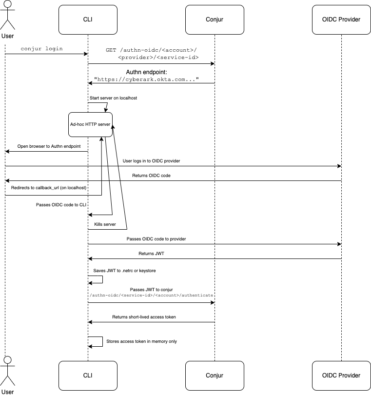

# Solution Design - Authn-OIDC/MFA Support in CLI

## Table of Contents

- [Solution Design - Authn-OIDC Support in CLI](#solution-design---authn-oidcmfa-support-in-cli)
  - [Table of Contents](#table-of-contents)
  - [Useful Links](#useful-links)
  - [Overview](#overview)
    - [Motivation](#motivation)
  - [Solution](#solution)
    - [User Experience](#user-experience)
      - [Feature Details](#feature-details)
      - [Scope](#scope)
  - [Performance](#performance)
  - [Backwards Compatibility](#backwards-compatibility)
  - [Affected Components](#affected-components)
  - [Test Plan](#test-plan)
    - [Test Cases](#test-cases)
      - [Unit Tests](#unit-tests)
      - [E2E tests](#e2e-tests)
      - [Security testing](#security-testing)
  - [Logs](#logs)
  - [Documentation](#documentation)
  - [Version update](#version-update)
  - [Security](#security)
  - [Audit](#audit)
  - [Development Tasks](#development-tasks)
  - [Solution Review](#solution-review)

## Useful Links

| Link | Private |
|------|:-------:|
| [Conjur Docs: OIDC Authentication](https://docs.conjur.org/Latest/en/Content/OIDC/OIDC.htm) | No |
| [Solution Design: Authn-LDAP Support in CLI](authn-ldap.md) | No |
| Confluence: MFA for Conjur UI - Architecture | Yes |
| Confluence: MFA Customer Documentation Changes - Dev Content | Yes |

## Overview

Conjur supports various forms of authentication, including OIDC (OpenID Connect). OIDC is unique in that requires the user to
navigate to a third party website (SSO provider) and authenticate there, often using MFA. The user then receives a token from
the SSO provider and passes this to Conjur, which verifies that the token is signed correctly by the trust SSO provider.
This document describes the design and implementation of the OIDC authentication support in the new Python-based Conjur CLI.

### Motivation

OIDC support was recently added to the Conjur UI (Enterprise only), initially to support SSO with Okta. We want to extend this
support to the CLI so developers using the CLI can authenticate to Conjur in the CLI with OIDC as they will in the Conjur UI.

## Solution

### User Experience

The `conjur init` command should support OIDC authentication as an authentication type. It should be possible to specify
the authentication type `oidc` using the existing `-t` or `--authn-type` option.
When using `oidc`, a `--service-id` option should be mandatory.

*Open question*: Currently, if the `--service-id` option is specified, then `--authn-type` defaults to `ldap`. Should we make this required
without a default value instead?

| Option | Acceptable Values | Default | Description |
| ------ | ----------------- | ------- | ----------- |
| `--authn-type` / `-t` | `authn`, `ldap`, `oidc` | ??? | The authentication method to use when connecting to Conjur |
| `--service-id` | `<service_id>` | N/A | The service_id of the OIDC service to use |

The `conjur login` command should open a browser (and print a link) to the OIDC URL configured for the SSO provider.
The user must then authenticate to the SSO provider and receive a JWT which will be stored in the user's keychain or in the .netrc file.
(See [below](#in-the-api-repository) for how the CLI will get the JWT token from the browser.)
Then when executing any CLI commands, the CLI will retrieve the stored JWT and pass it to Conjur's OIDC authentication endpoint and receive
a short-lived accesss token, as with all other authentication strategies.

*Open question*: Can we revoke the JWT when `conjur logout` is called?

#### Feature Details

##### Diagram

##### In the CLI repository

The CLI needs to support the new CLI argument values in the `init` command, and it will need to pass them to the conjur-api-python library.
Regarding the `login` step, this will be implemented very differently than the other authentication strategies (see details
[below](#in-the-api-repository)).
While this will mostly be contained in the API repository, there will need to be changes made to the login controller and logic
in the CLI repository. For instance, when using authn-oidc, we won't be prompting the user for a username and password as this will
be determined by the SSO provider.

##### In the API repository

Create a new implementation of `AuthenticationStrategyInterface` called `OidcAuthenticationStrategy` which will handle the
authentication logic. In it's `login()` method, it should reach out to the Conjur API (`/authn-oidc/<account>/provider/<service-id>`)
and retrieve the necessary authentication endpoint URL (and also `state`, `nonce`, and `code_verifier`) for the specified OIDC
authenticator, and then open a browser (and print a link) to the authentication endpoint URL. The API will need to serve up a temporary web
server on localhost with an available port to use as the callback URL.
This temporary server will listen for just one endpoint and extract the code from the response's query string or POST body.
The code will then be passed back to the API code where it can call the OIDC endpoint to exchange the code for a JWT which
will be saved in the `CredentialsProviderInterface`. We must validate the JWT before accepting or storing it.
We should store the entire content of the JWT, including fields such as `expires_at`, so we can handle expiration gracefully.

Sample Python code for this OIDC flow can be found
[here](https://github.com/puiterwijk/python-openidc-client/blob/master/openidc_client/__init__.py#L446).
A Golang example is available [here](https://medium.com/@balaajanthan/openid-flow-from-a-cli-ac45de876ead).

In the `authenticate()` method, the API should retrieve the saved JWT from the `CredentialsProviderInterface` and check for expiration. If it has not expired,
the API should send it to the Conjur `/authn-oidc` endpoint which will return a short lived access token which will only be stored in memory.
In the case that the JWT is expired, the `login()` step will need to be repeated.

#### Scope

Initially we will support Okta's implementation of OIDC without refresh tokens. In a future milestone we will add support
for other providers such as CyberArk Identity and Microsoft ADFS. We will also likely add support for refresh tokens in order
to decrease the frequency that user interaction is required due to token expiration.

Another nice-to-have feature would be support for the OIDC flow when running the CLI in Docker. Because of the HTTP server,
we would need to expose a port from the container and use a URL other than localhost (possibly a local IP address) to
access it from the host.

## Performance

From the user perspective, using OIDC will be slower than other authentication approaches due to the extra steps involving a
third party website (the SSO provider) and the additional Conjur endpoint for retreiving the SSO endpoint URL.

## Backwards Compatibility

The API will be fully backwards compatible, as this only adds new options.
The CLI may have a single breaking change, depending on our decision ([above](#user-experience)) about the default value of
the `--authn-type` option when `--service-id` is present.

## Affected Components

- [cyberark/conjur-api-python](https://github.com/cyberark/conjur-api-python)
- [cyberark/cyberark-conjur-cli](https://github.com/cyberark/cyberark-conjur-cli)

## Test Plan

### API

We will need to create new unit tests in the API for the OIDC authentication flow.
We will need to test all OIDC logic, and particularly that JWT tokens are handled and validated correctly.

### CLI

We will need to create new unit tests and integration tests for the new CLI options.

We will need a dummy OIDC server that can imitate OKTA's implementation for use in integration tests.
Possible examples include [github.com/Soluto/oidc-server-mock](https://github.com/Soluto/oidc-server-mock) and
[github.com/citizensadvice/mokta](https://github.com/citizensadvice/mokta).

### Test Cases

#### Unit Tests

#### E2E tests

E2E tests are expensive. We should limit E2E testing to happy path "smoke
tests", and leave sad path testing to unit testing and lower level functional
tests.

#### Security testing

Security testing will include:

- Automated Vulnerability scans
- Unit tests that ensure invalid JWTs are discarded
- Unit tests to ensure the code is not vulnerable to other common JWT attacks

## Logs

## Documentation

We will need to update official documentation for the CLI to include the new options for OIDC. This includes the new options
for the `conjur init` command as well as to document the details of OIDC authentication, including the limitation that
it can't be used on a headless system due to requiring a browser.

## Version update

The CLI will need a new minor version, since this will add new features but not break existing functionality.
If this is released before 7.2.0, it can be included in that release. Otherwise it will need to be 7.3.0.

The API will also need a new minor version.
If this is released before 8.0.0, it can be included in that release. Otherwise it will need to be 8.1.0.

## Security

This feature will require several security reviews due to the fact that it involves authentication. There should be individual reviews of

1. The Ad-hoc HTTP server used for OIDC callback. Should follow [these](https://datatracker.ietf.org/doc/html/rfc8252#section-8.3) recommendations from the OAuth docs.
2. Handling and validation of JWTs
3. A final security review of the full implementation

## Audit

Auditing will happen on the Conjur server. No changes are needed in the CLI or API.

## Development Tasks

| Description | Jira Story | Estimated Story Points  | Completed |
|-------------|------------|-----------|-----------|
| Support `--authn-type oidc` in `conjur init` command | ONYX-25481 | 1 | |
| Set up Okta dev environment | ONYX-25482 | 2 | |
| Implement `OidcAuthenticationStrategy` in API | ONYX-25484 | 5 | |
| Support `OidcAuthenticationStrategy` in CLI | ONYX-25485 | 3 | |
| Security review + hardening: Ad-hoc HTTP server | ONYX-25486 | 2 | |
| Security review + hardening: JWT handling & validation | ONYX-25487 | 3 | |
| Integration tests for OIDC in CLI | ONYX-25489 | 5 | |
| [Spike] Support running CLI in Docker | ONYX-25490 | 1 | |
| Assist TW to update docs | ONYX-25491 | 1 | |
| Security review: Full implementation | ONYX-25492 | 1 | |

## Solution Review

<table>
<thead>
<tr class="header">
<th><strong>Persona</strong></th>
<th><strong>Name</strong></th>
<th><strong>Design Approval</strong></th>
</tr>
</thead>
<tbody>
<tr class="odd">
<td>Team Leader</td>
<td>John Tuttle</td>
<td><ul>

 

</ul></td>
</tr>
<tr class="even">
<td>Product Owner</td>
<td>Jane Simon</td>
<td><ul>

 

</ul></td>
</tr>
<tr class="odd">
<td>System Architect</td>
<td>Jason Vanderhoof</td>
<td><ul>

 

</ul></td>
</tr>
<tr class="even">
<td>Security Architect</td>
<td>Andy Tinkham</td>
<td><ul>

 

</ul></td>
</tr>
<tr class="odd">
<td>QA Architect</td>
<td>Adam Ouamani</td>
<td><ul>

 

</ul></td>
</tr>
</tbody>
</table>
