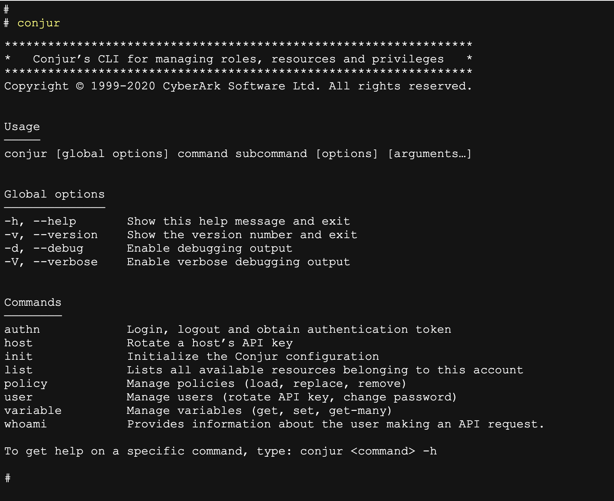

# Python CLI UX Guidelines

These guidelines intend to provide UX guidelines for Conjur's new Python CLI, focusing on a consistent structure and a more user-friendly interface.

1. The tool’s executable name should be “**conjur**” (regardless of its supported platform), so “conjur-py3-cli-darwin” is not a good experience.

2. If the CLI tool is executed **without** **any** **commands**, we should show the full help screen.

3. Make sure to provide short-form (e.g. -h) and long-form (--help) for each option.

4. Provide helpful and **readable** **feedback** when a command succeeds and doesn’t have an output. It should end in a new line and show a feedback message. E.g., `Success! Data written to: <target>`

5. Provide helpful and **readable** **errors** (we currently show exception and line number). A typical error message would be: `Error: Command failed. No such file or directory: ‘/Users/sharonr/.conjurrc’` (need to consider if we need to show an error log number).

6. When a command is executed with **missing** **parts** (subcommand, argument), unfamiliar syntax and so on, show the relevant error along with the command's help below that. Note: a list of various error scenarios is provided in a separate file.
   Example of an unknown command:
   ```
   Error: Unknown command 'test'
   <Main help screen>
   ```

7. Exit codes: commands with no errors will return exit code 0, while errors will return exit code 1. 

8. Keep a structured syntax and easy to type, so it will be efficient to use.
   The general structure would be: `conjur [global options] command subcommand [options] [arguments...]`

   1. Example of a compound command: `conjur user update-password`
   2. Example of multiple arguments: `conjur variable get secrets/secret1 secrets/secret2`
   3. Example of an argument with spaces: `conjur variable get "secrets/secret two" 

9. Help command structure:

   1. CLI header (title and short explanation)
   2. Copyright
   3. Usage: title + explanation
   4. Global options: title + list of options and their explanation
   5. Commands: title + list of commands and their explanation 
   6. Footer: To get help on a specific command, type: conjur command -h

   Note: The general help screen and the help for each command can be found in this [mockup](https://ljfz3b.axshare.com/#id=yokln4&p=conjur_main_help&g=1).
   
   Example of this help screen: 
   

## Nice to have:

1. Use terminal colors – We can add colors for command and subcommands to better differentiate them. [See reference](https://www.geeksforgeeks.org/print-colors-python-terminal/).

2. We should support **tab**-**completion**:
   - Typing the first few characters of the command name followed by `<tab> <tab>`, will auto-complete the command.
   - Hit space after a command, then `<tab> <tab>` again, will shows a list of available sub-commands
