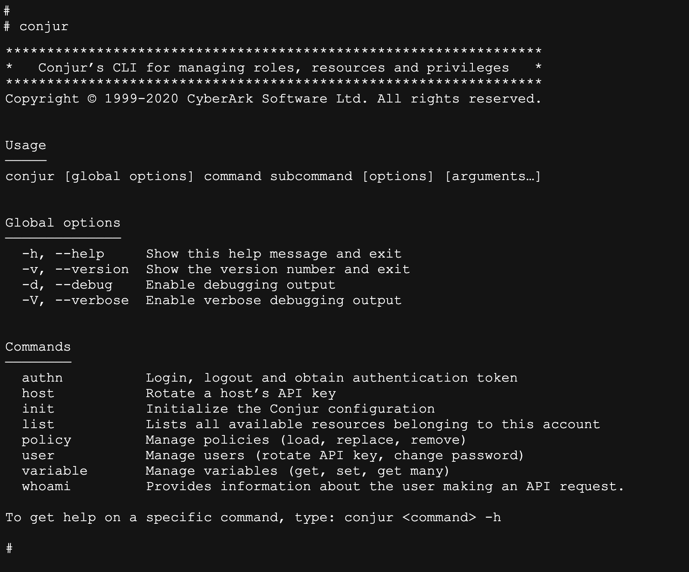

# Python CLI UX Guidelines

1. The tool’s executable name should be “**conjur**” (regardless of its supported platform), so “conjur-py3-cli-darwin” is not a good experience.

2. If the CLI tool is executed **without** **any** **commands**, we should show the help and usage.

3. Make sure to provide short-form (e.g. -h) and long-form (--help) for each option.

4. Provide helpful and **readable** **feedback** when a command succeeds and doesn’t have an output. It should end in a new line and show a feedback message. E.g., `Success! Data written to: <target>`

5. Provide helpful and **readable** **errors** (we currently show exception and line code). A typical error message would be: `ERROR: Command failed. No such file or directory: ‘/Users/sharonr/.conjurrc’` (need to consider of we need to show an error log number).

6. When a command is executed with **missing** **parts** (subcommand, argument), unfamiliar syntax and so on, show the relevant error along with the command's help below that. A list of various error scenarios is provided on a separate file.
   Example of an unknown command:
   `Error: Unknown command 'test'`
   `[Conjur CLI help screen]`

7. Exit codes: commands with no errors will return exit code 0, while errors will return exit code 1. 

8. Keep a structured syntax and easy to type, so it will be efficient to use (especially for double word commands.
   The structure would be: `conjur [global options] command subcommand [options] [arguments...]`
   Example of double-word commands: `conjur user update-password`
   Example of multiple arguments (separated by commas): `conjur variable get secrets/secret1,secrets/secret2`

9. Help command structure:

   1. CLI header (title and short explanation)
   2. Copyright
   3. Usage: title + explanation
   4. Global options: title + list of options and their explanation
   5. Commands: title + list of commands and their explanation 
   6. Footer: To get help on a specific command, type: conjur <command> -h

   The help for each command is written in the epic itself.
   Example of this help screen: 
   

   

## Nice to have:

1. Use terminal colors – We can add colors for command and subcommands to better differentiate them.

2. We should support **tab**-**completion**:
   - Typing the first few characters of the command name followed by <tab> <tab>, will auto-complete the command.
   - Hit space after a command, then <tab> <tab> again, will shows a list of available sub-commands
