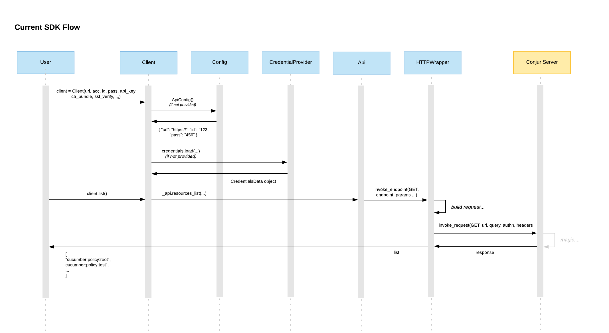
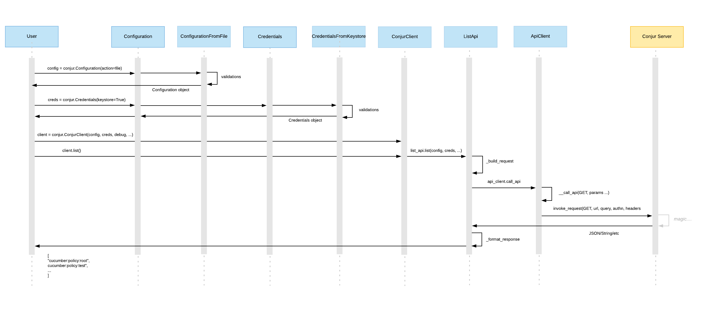

# SDK Refactor Design Proposal

This document outlines the limitations of the current SDK implementation and provides a detailed design for its refactor.

### Table of contents

- [SDK Refactor Design Proposal](#sdk-refactor-design-proposal)
    + [Table of contents](#table-of-contents)
    + [Resources](#resources)
    + [Motivation](#motivation)
    + [Current SDK implementation](#current-sdk-implementation)
      - [Flow](#flow)
    + [Limitations in current SDK Flow](#limitations-in-current-sdk-flow)
        * [Client constructor](#client-constructor)
        * [Proposed flow](#proposed-flow)
        * [API and commands](#api-and-commands)
        * [Proposed flow](#proposed-flow-1)
    + [Full proposed SDK flow](#full-proposed-sdk-flow)

### Resources

| Resource                  | Link                                      |
| ------------------------- | ----------------------------------------- |
| Zen of Python (the Bible) | https://www.python.org/dev/peps/pep-0020/ |


### Motivation

While GAing the CLI, it was realized that the SDK has the following limitations, making the code not easily readiable and hard to make additions:

1. Classes handle multiple responsibilities, impeding on the ability to cover current and future usecases without expensive refactoring
2. Implicit instead of explicit, forcing the end-user to understand the inner workings of our Client and the context they are running in, instead of allowing them to explicitly accomplish their desired flow. See [Zen of Python](https://www.python.org/dev/peps/pep-0020/) for more details.
3. Areas of volatility are not encapsulated, becomes problematic when the requirements change or additions need to be made.

In this document, I will go into more detail for each of these points as well as supply a proposal for how to address them.


### Current SDK implementation

#### Flow

The below image details the calls from when a user initalizes the *current* Client to when they receive a response.



At a high level,

1. The user initializes the *Client* with details needed to connect to the *Conjur server*

    `client = conjur.Client(url="https://someserver", account="cucumber", password="123", ...)`.

2. The *Client* constructor is called, ensuring all configuration and credential information needed to make a request have been passed in. If not, it fetches the missing information in a discovery-like manner. For example, for `login`, if a Keystore is not available, it will attempt to fetch credentials from the netrc. At this point the *API* is also initalized.

3. *Client* is now initalized and the user can now make a request.

   `list_values = client.list()`

4. Once a request is made, the *Client* makes a call to *API* which handles the building of the request, merging paramters together, understanding which endpoint to use, etc.

5. The *API* calls the *HTTPWrapper* which escapes the parameters and invokes the endpoint to the *Conjur Server*.

6. A response is returned to the *HTTPWrapper*, handing it back to the calling *API* which formats the response to the desired output.

7. *API* returns the formatted response to the *Client* and the *Client* returns it to the user. 


### Limitations in current SDK Flow

This section will be divided according to the three areas in the code that need to most attention (Client, Api, and Commands). In each section, I will outline their limitations, the consequences of their limitations, and provide a proposal for how to address them.

##### Client constructor

The Client constructor resembles the following:

```python
# client.py
class Client():
    def __init__(self,
                 account: str = None,
                 api_key: str = None,
                 ca_bundle: str = None,
                 debug: bool = False,
                 http_debug=False,
                 login_id: str = None,
                 password: str = None,
                 ssl_verify: bool = True,
                 url: str = None):
      ...
      if not url or not login_id or (not password and not api_key):
        # load in Configuration details (if not provided)
        # load in Credential details (if not provided)
        # instantiate API objects according to the different params provided
        ...
        if api_key:
          ...
        elif password:
          ...
        else
          ...     
```

See Client [code](https://github.com/cyberark/conjur-api-python3/blob/main/conjur/api/client.py#L51) for reference.

1. Multiple responsibilities and not easily expandable.

   a. The constructor consumes 92 lines and handles fetching configuration and credential data, validating the input, configuring API calls, error handing, etc. This makes impacts code readability and should be broken up.

   b. The constructor expects to have all configuration and credentials loaded by the time it is instantiated. If not, it attempts to fetch the missing information. This is problematic for flows such as `init`,  `login` that have not yet been run and therefore cannot use the Client.

   c. In the CLI, we attempt to discover the organization's account for the user during the `init` flow. To get this information, we don't need to actually login to the Conjur server to get this information. We need to instead query `/info`. Because the Client is not expandable, this has forced us to bring over request logic to our logic code to avoid having to pass login information. See [InitLogic](https://github.com/cyberark/conjur-api-python3/blob/main/conjur/logic/login_logic.py#L54) for reference.

2. Implict instead of explicit. 

   a. The constuctor performs discovery depending on the parameter combination provided. A common example of this is when fetching credentials. The Client will search for credential details in the netrc only if a Keystore is not found. This is unnecessarily added work and as a result of this implicity, the user needs to be fully aware of the context of their environment.

3. Areas of volatility are not encapsulated.

   a. The constructor's parameters in the method signature are not encapsulated. It accepts 9 hanging parameters when they can instead be encapsulated into related objects. 

   b. We can expect changes in the following areas in future iterations:

   ​	i. Method of fetching configuration. Currently, we support fetching configuration details from the conjurrc file but this can change in the future and we will support methods in the future (via environment variables, etc).

   ​	ii. Method of fetching credentials (via the netrc file or keystore). Currently, we support fetching credential data from the keystore or the netrc file.

   Because of all these possible changes, we need to encapsulate them so that when changes arise, they are contained, without effecting the system.

For these reasons, I propose we extract the configuration and credential information to their own objects to be created by the user before the Client is called. In those classes, all the collection and validations will be performed. As a result, the Client constructor will not be forced to be in charge of handle multiple responsibilities, the user will have to explicitly define the and the areas of volatility will be contained.

We can handle the separation in one of the following ways:

|      | Solution                                        | Description                                                  | Pros                                                         | Cons                                                         |
| ---- | ----------------------------------------------- | ------------------------------------------------------------ | ------------------------------------------------------------ | ------------------------------------------------------------ |
| 1    | Keep as is                                      |                                                              | - Doesn't break current user apps<br />- Seems to be the direction the industry is going | - 92 lines and 9 params so far makes it unweidy<br />- Constructor is overloaded, handling multiple responsibilities<br />- Doesn't take advantage of OOP |
| 2    | Config/Creds objects for *each* supported flow  | ConfigurationFromFile()  - .conjurrc<br />ConfigurationFromEnv() - ENV vars<br />CredentialsFromFile() - netrc<br />CredentialsFromKeystore() - keystore | - Explicit, the flow the user chooses is very clear<br />- Security is up to user's the discretion | - Conflicting experience with CLI. The CLI performs a discovery on Config/Creds retrieval type<br />- Requires changes when a user wants to choose another flow |
| 3    | Generic Config/Creds object                     | Configuration()<br />Credentials()<br />and we will discover where the connection details live based on environment's context | - Easy maintainability. No change in user's code as we build new ways to fetch config and creds<br />- Aligns with CLI UX of Config/Cred discovery | - Implicit and the flow we choose is not clear               |
|      | A single Config/Cred object with defining param | Configuration(action=file) - .conjurrc<br />Credential(action=keystore) | - Explicit<br />- Minimal code changes should the user choose a different flow<br />- Strong drive in Python to be as explicit as possible | - Requires changes in code if user wants to adopt another retrieval method<br />- Conflicting experience with CLI. The CLI preforms a discovery on Config/Creds retrieval type |

**Decision:** Option #4. 

The flow for configuration and credential will be determined *explicitly* by enabling the user to pass in the flow of their choosing via a parameter to the object during instantiation. 

This functionality will be implemented using the [Factory pattern](https://refactoring.guru/design-patterns/factory-method). Each factory-generated class will have its own implementation and validation mechanism. This will make the implementation easy to maintain as this makes it easy to swap algorithms used inside an object during runtime. That way, we can isolate the implementation details from the *Client*. If we choose to implement a new strategy, for example fetching values from environment values, this will not require a change in the Client.

##### Proposed flow

```python
config = client.Configuration(action=file)
creds = client.Credental(action=keystore)
client. conjur.ConjurClient(config, creds, debug, ssl_verify)
```

```python
# data object representing the configuration data 
# needed to connect to the Conjur server
class ConfigurationModel(action = None,
                         url = None,
                         account = None,
                         ca_bundle = None,
                         ssl_verify = True):

# configuration factory deciding which flow to run based on user input
class Configuration()
	if configuration.action == "file":
		return ConfigurationFromFile(configuration)
  elif configuration.action == "env":
		return ConfigurationFromEnv(configuration)
  
class ConfigurationFromFile(ConfigurationStrategy)
	def __init__(url=None, 
               account=None,
               ca_bundle=None,
               ssl_verify=True)
		
    self.validate()
    
  # validates all parameters were given
  def validate():
    if not self.url:
      raise ValueError("Error: Appliance URL not provided") 
    # ...
```

Note: the same pattern will be implemented for Credentials. 

For both Configuration and Credential flows, we will still support the ability for users to build these objects themselves. If so, we won’t fetch the values from disk or any other supported mediums for them. For example:

```python
config = client.Configuration(url="https://someserver", account="cucumber", cert_file="/some/certfile")
creds = client.Credental(machine="https://someserver", username="someuser", api_key="123")
client. conjur.ConjurClient(config, creds, debug, ssl_verify)
```

We will *not* create the conjurrc and the netrc for the user as is true in the current state of the SDK. 

We will *not* support partial states as is true in the current SDK. For example, we will not support the flow if a user provides `client.Configuration(action=file, url="https://someserver", account="", cert_file="/some/certfile")`. In this flow we will fail with relevant error.


##### API and commands

The following code excerpt was taken from the current implementation of *Client* and *API* classes:

```python
class Client()
  def __init__(...):
    self._default_params={...}
    self._api = Api(...)

  def list(self, list_constraints: dict = None) -> dict:
      return self._api.resources_list(list_constraints)

    
class Api()
    def __init__(self,
                 account: str = 'default',
                 api_key: str = None,
                 ca_bundle: str = None,
                 http_debug=False,
                 login_id: str = None,
                 ssl_verify: bool = True,
                 url: str = None):

  	# ...
    
def resources_list(self, list_constraints: dict = None) -> dict:
    """
    This method is used to fetch all available resources for the current
    account. Results are returned as an array of identifiers.
    """
    params = {
        'account': self._account
    }
    params.update(self._default_params)
    if list_constraints is not None:
        json_response = invoke_endpoint(HttpVerb.GET, ConjurEndpoint.RESOURCES,
                                        params,
                                        query=list_constraints,
                                        api_token=self.api_token,
                                        ssl_verify=self._ssl_verify).content
    else:
        json_response = invoke_endpoint(HttpVerb.GET, ConjurEndpoint.RESOURCES,
                                        params,
                                        api_token=self.api_token,
                                        ssl_verify=self._ssl_verify).content

    resources = json.loads(json_response.decode('utf-8'))

    # Returns the result as a list of resource ids instead of the raw JSON only
    # when the user does not provide `inspect` as one of their filters
    if list_constraints is not None and 'inspect' not in list_constraints:
        # For each element (resource) in the resources sequence, we extract the resource id
        resource_list = map(lambda resource: resource['id'], resources)
        return list(resource_list)
```

See the  [Client class](https://github.com/cyberark/conjur-api-python3/blob/main/conjur/api/client.py) and [API class](https://github.com/cyberark/conjur-api-python3/blob/main/conjur/api/api.py#L128) and for more details.

1. Multiple responsibilities and not easily expandable.

The *API* class handles multiple responsibilities. The API class handles the building of the request based on the types of information provided by the user *and* the invoking of the call *and* formatting the response.

2. Areas of volatility are not encapsulated.

We can add commands, change the way we present a certain command's output, and/or the types of parameters can manipulate the overall flow. Each command has its own associated function in `client.py` and `api.py` so each time we want to add a new command, we need to re-open multiple classes and add the desired functionality. This overcrowds the *Api*, allowing command-specific logic to spill into a very general class. 

##### Proposed flow

For these reasons, I propose we extract the command-specific logic into its own class. That way, the the *Api* class will be exposed to the specific details of a command, how to package the request, how to make the call, what format the request should be in. This works to isolate the areas of volatility should we require to support different use cases for a command. 

```python
class ConjurClient()
	def __init__(...):
    self.api_client = ApiClient()
    
	def list(self, list_constraints: dict = None) -> dict:
    list_api = ListApi(list_constraints)
	  return self.list_api.execute(list_constraints)

# interface common to all commands (list, variable, policy, etc)
class CommandInterface()
	def build_request()
  def execute()
  def format_request()
  
class ListApi(CommandInterface)
	def __init__(api_client = None):
    self.api_client = api_client

	def build_request(list_constraints: dict = None)
		# … validate …
		# … build params for request
		# … return built list request
    
	def format_request()
		# … format request (JSON, string, etc)
    
  def execute(list_constraints: dict = None)
		# builds the request
    self.build_request(list_constraints)  
    # makes the API call
		response = self.api_client.call_api(…)
    # formats response to List/JSON/etc
		return self.format_request(response)
  
class ApiClient():
  def __init__(...):
     # …    

  def call_api(...)
  	# 1. build query and headers
		# 2. escape data
    # 3. perform request
    # 4. return response

```


### Full proposed SDK flow



At a high level,

1. The user will initalize a Configuration and Credential object, *separate* from the Client

   `config = conjur.Configuration(action=file)`, `creds = conjur.Credentials(action=keystore)`

2. For each flow, Configuration and Credential classes will determine which flow to use and perform the relevant validations

3. *Configuration* and *Credentials* objects will be returned to the user to be used when initalizing the Client

4. The Client is initalized,

   `client = conjur.ConjurClient(config, creds, debug=True, ...)`

5. The user can now make a request,

   `list = client.list()`

6. Once a request is made, the *ConjurClient* makes a call to the command's associated API class, *ListAPI* which will handle all things list-specific; will build the request, make the request, and format the response

7. The *ListAPI* will then make a request to the *APIClient* which will handle the escaping of parameters, build headers, decide to run in a secure or unsecure flow, etc.

8. *APIClient* makes a request to the *Conjur server* and returns the response to be formatted.

9. The formatted response is returned to the user.
